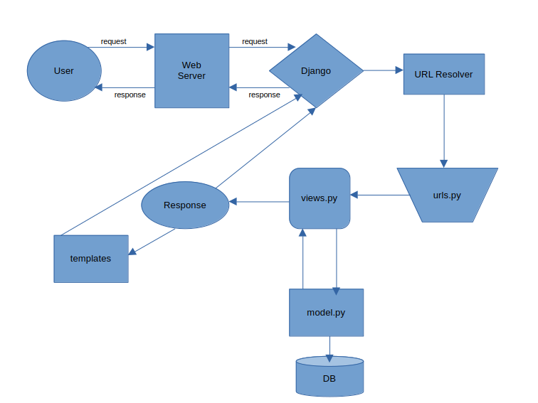

# learning_Django
Sharing my Django journey with Sir [Hitesh Choudhary](https://www.linkedin.com/in/hiteshchoudhary/) from [Chai aur Django](https://youtube.com/playlist?list=PLu71SKxNbfoDOf-6vAcKmazT92uLnWAgy&si=pghcoCquTC_g3axO)

    Django is high-level python web framework yhay encourages rapid development and clean, pragmatic design.
 It follows MVC(Model-View-Controller) architectural pattern. It provides a set of tools and libraries for
 building web applications, including an ORM, a templating engine and a built-in admin interface.

## Table of Contents
- [Setup_virtual-env](#setup_virtual-env)
- [Starting_Django_Project](#starting_django_project)

## Setup_virtual-env <a name="setup_virtual-env"></a>
I choose uv for managing packages and venv because it's faster.
```bash
pip install uv
```
and now crteating venv
```bash
uv venv
```
now I activate venv 
```bash
source .venv/bin/activate
```

## Starting_Django_Project <a name="starting_django_project"></a>
Installing Django inside virtual-environment(.venv)
```bash
uv pip install Django
```
Creating a django project, a django project is collection of settings and configurations that define the structure and behaviour of a web application.
It includes applicatio code, template, statiuc files and other resources that make up the application.
```bash
django-admin startproject chaiaurdjango # This will create a folder chaiaurdjango with basic structure of a Django project
cd chaiaurdjango
```
Starting a Django server
```bash
python manage.py runserver <port for listening> 
```
above command will deploy a server which will be listening on port :8000, by default it will listen on 8000, so we can ommit the port number.

### key-points:
* There are different level of a python project directory, like root level, project level, app level.
* Important file in Djangos are manage.py, urls.py, views.py, settings.py

* In **views.py** one method should be there for accessing homepage and that method always will be named as **home**. Other method can be of any name. 
* In urls.py's urlpatterns list path function there should be **name** parameter in any path function for great practice.
* **from django.http import HttpResponse** for creting response methods in views.py



## Templates <a name="templtaes"></a>
* Create a directory named **templates** in root level of your project, this folder contains **html** files.
* In root level also create a directory named **static**, contain all **css** and **javascript** filess.
* html files from templates will be use in **render** function in views.py's response methods. render function is from **from django.shortcuts import render** (if there is sub directory inside templates then give related path to html files in render function)
* inside **settings.py** , at **TEMPLATES** list's one item is a dictionary whoose key **DIRS** value is a list, add 'templates' in that list to render all html files from templated directory
* to load static assets in html file we will use template engine
    * at the top of html file before doctype also write , then we can only uses static inside attribute value where needed
    * like to load css inside head tag of html file inside link tag we will set href attribute like href={"% static 'style.css' %}
    * in **settings.py** import os and under STATIC_URL create a list named STATICFILES_DIRS = [os.path.join(BASE_DIR, 'static')], doing this django knows where to find static files